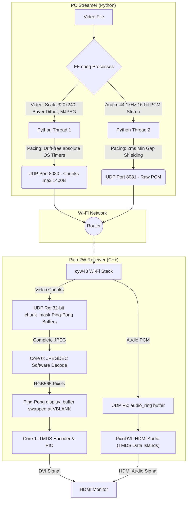
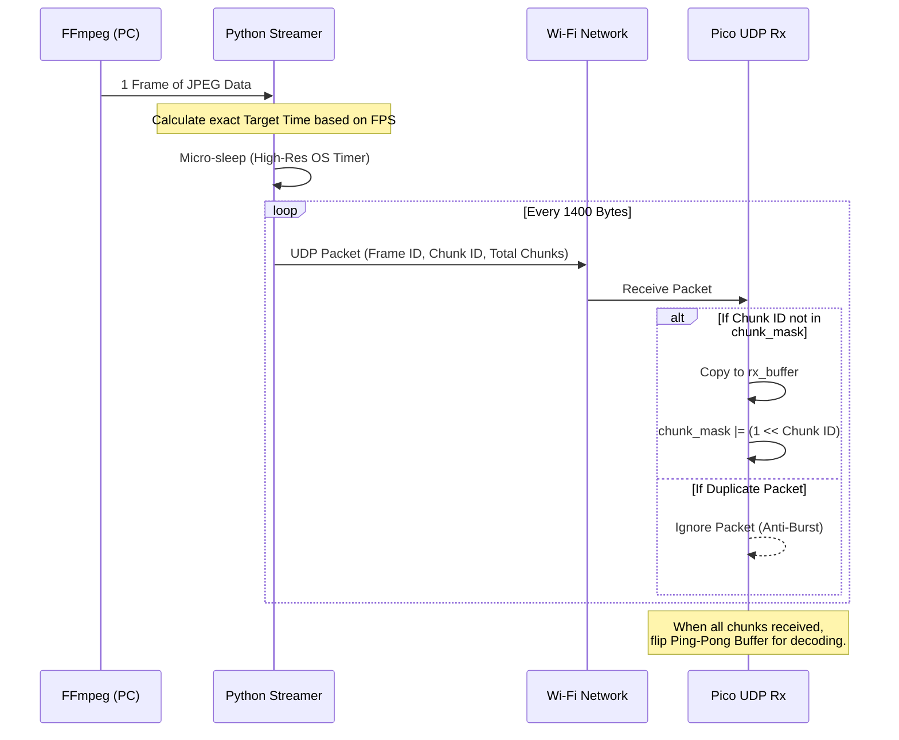
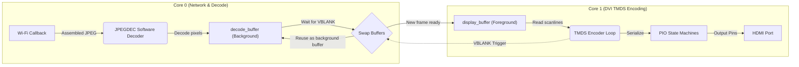
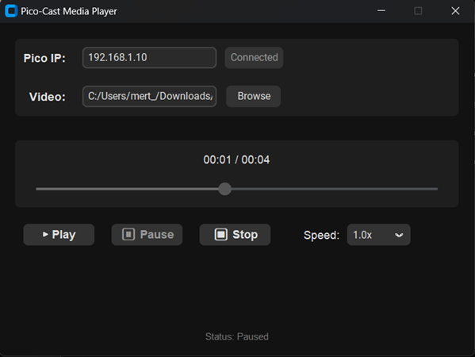
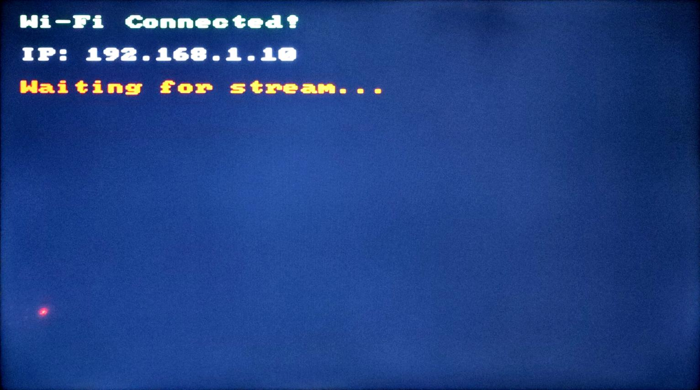

# Pico-Cast 📺

<p align="left">
  
  
  
  
</p>

**Pico-Cast** is a highly optimized media streaming ecosystem designed specifically for the **Raspberry Pi Pico 2W** paired with the **Olimex RP2040-PICO-PC Carrier Board**. It turns your Pico 2W into a wireless HDMI receiver, streaming synchronized video and audio directly from your PC over Wi-Fi. 

It uses FFmpeg to dynamically compress, scale, and dither video in real-time, resulting in a gorgeous, cinematic viewing experience on any HDMI monitor.

This project is deeply tailored to this specific hardware combination. It uses a custom drift-free absolute-time Python UDP sender and a dual-core C++ receiver with anti-burst UDP protection to push the Pico 2W's RP2350 chip to its absolute limits.

---

## 📑 Table of Contents
- [Features](#features)
- [Important Hardware Requirements](#hardware)
- [Hardware Specifications & Pinouts](#specs)
- [Usage & Controls](#usage)
- [Installation & Setup](#setup)
- [Architecture Flowcharts](#flowcharts)
- [Screenshots](#screenshots)
- [Open Source Libraries](#libraries)
- [Notes & License](#license)

---

## <a id="features"></a>🚀 Features
- **Synchronized Video & Audio**: Streams high-framerate video and 44.1kHz PCM Audio completely synchronized over UDP.
- **Zero-Delay Seeking & Scrubbing**: Fully modern, dark-themed Media Player GUI (`customtkinter`) for PC.
- **Zero CPU Footprint**: Uses Windows High-Resolution OS Timers (`timeBeginPeriod`) for 1ms micro-pacing, dropping Python CPU usage to near 0%.
- **Anti-Burst UDP Shield**: C++ Receiver uses 32-bit chunk masks and ring buffers to prevent lwIP packet duplication and drop-outs during rapid scrubbing.
- **Dynamic Playback Speed**: Change playback speed on the fly (0.5x to 2.0x) using pure FFmpeg `atempo` and `setpts` filters, ensuring network bandwidth remains strictly at 1x hardware speed to prevent buffer overflows.
- **Bayer Dithering & Unsharp Mask**: Eliminates color banding for a "Millions of Colors" look on a 16-bit framebuffer while maintaining pristine crispness.

---

## <a id="hardware"></a>⚠️ Important Hardware Requirements
This codebase is **NOT** meant to run on generic setups. It is strictly designed for the following exact hardware combination:

1. **Raspberry Pi Pico 2W**: The code relies heavily on the power of the new chip and the onboard CYW43 Wi-Fi module. A standard Pico 2 (without Wi-Fi) or an older Pico W will not work optimally.
2. **Olimex RP2040-PICO-PC Carrier Board**: This board acts as a carrier/docking station for the Pico 2W. It provides the physical HDMI connector perfectly routed to the correct GPIO pins.

*Note: While it is theoretically possible to manually solder an HDMI breakout board directly to a standalone Pico 2W using the exact pinout below, it is highly unergonomic.*

---

## <a id="specs"></a>🛠 Hardware Specifications & Pinouts

- **Microcontroller**: Pico 2W (Overclocked to 252 MHz at 1.25V).
- **RAM Constraint**: Decoding 320x240 directly into memory requires ~307KB for the Ping-Pong framebuffers and 40KB for the Ping-Pong JPEG UDP Rx buffers.
- **Audio Constraint**: Dedicated 2048-sample ring buffer for seamless PCM audio streaming embedded directly into the HDMI signal (TMDS Data Islands).

### Olimex Carrier Board HDMI Pinout
The Olimex RP2040-PICO-PC routes the Pico's pins to the HDMI port as follows:
| Signal | Pico 2W GPIO Pin |
|--------|------------------|
| TMDS D0| 14               |
| TMDS D1| 18               |
| TMDS D2| 16               |
| CLK    | 12               |

*(Note: Audio is transmitted digitally over these exact same TMDS pins. The physical I2S pins on the Olimex board are intentionally bypassed and not used by this project).*

---

## <a id="usage"></a>🎮 Usage & Controls

> **Note**: Before proceeding, please ensure you have completed the steps in the [Installation & Setup](#setup) section.
> 
> **Linux Users**: The Python GUI has not been officially tested on Linux environments, but it is fully cross-platform and expected to work seamlessly.

Once your Pico 2W is connected to your TV and shows its IP address (e.g., `192.168.1.100`), you are ready to stream!

1. Open a terminal on your PC.
2. Navigate to the streamer directory:
   ```bash
   cd pc_streamer
   ```
3. Run the Media Player GUI:
   ```bash
   python stream.py
   ```
4. **Enter the Pico's IP address** into the top box.
5. Click **Connect**.
6. **Browse** and select any video file (.mp4, .mkv, .avi, etc.).
7. Click **Play** and enjoy the cinematic stream on your TV!

---

## <a id="setup"></a>⚙️ Installation & Setup

### 1. Requirements for PC (Windows)
1. **Python 3.10+**: Make sure Python is installed.
2. **FFmpeg**: The core media engine.
   - **For Windows**: The easiest way to install FFmpeg is using the built-in Windows Package Manager (`winget`). Open your Terminal or PowerShell and run:
     ```powershell
     winget install ffmpeg
     ```
     *(Restart your terminal after installation so the `ffmpeg` command is recognized).*
   - **For Linux (Ubuntu/Debian)**: Run the following command in your terminal:
     ```bash
     sudo apt update && sudo apt install ffmpeg
     ```
3. **Python Libraries**:
   Open a terminal and run:
   ```bash
   pip install customtkinter
   ```

### 2. Flashing the Pico 2W

You have two options to install the software on your Pico 2W. **Method A (Arduino IDE)** is highly recommended for beginners as it requires no complex toolchains.

#### Method A: Arduino IDE (Recommended & Easiest)
This method allows you to compile and upload the code using the friendly Arduino interface.

1. **Install Arduino IDE**: Download and install the [Arduino IDE](https://www.arduino.cc/en/software).
2. **Add RP2040/RP2350 Boards**: 
   - Open Arduino IDE, go to **File -> Preferences**.
   - In the "Additional Boards Manager URLs" field, paste this URL:
     `https://github.com/earlephilhower/arduino-pico/releases/download/global/package_rp2040_index.json`
   - Go to **Tools -> Board -> Boards Manager**, search for `pico` and install **Raspberry Pi Pico/RP2040/RP2350 by Earle F. Philhower, III**.
3. **Open the Project**:
   - Navigate to the `pico_receiver-arduino` folder in this repository.
   - Double click `pico_receiver-arduino.ino` to open it in the Arduino IDE.
4. **Enter Wi-Fi Credentials**:
   - In the code, look at line 28:
     ```cpp
     const char* WIFI_SSID = "YOUR_WIFI_SSID";
     const char* WIFI_PASSWORD = "YOUR_WIFI_PASSWORD";
     ```
   - Change `"YOUR_WIFI_SSID"` and `"YOUR_WIFI_PASSWORD"` to your home Wi-Fi details. Keep the quotes!
5. **CRITICAL IDE Settings**: You must configure the Arduino Tools menu exactly like this for the video stream to work. Go to **Tools** and set:
   - **Board**: `Raspberry Pi Pico 2W`
   - **CPU Speed**: `250 MHz (Overclock)` *(Required for 640x480 DVI timing)*
   - **Optimize**: `Optimize Even More (-O3)` *(Required to prevent video lagging/red lines)*
   - **IP/Bluetooth Stack**: `IPv4 Only`
6. **Upload**:
   - Hold the **BOOTSEL** button on your Pico 2W and plug it into your computer via USB.
   - Select the new UF2 Port in **Tools -> Port**.
   - Click the **Upload** (Right Arrow) button at the top left of the IDE.
   - Once it says "Done uploading", plug the Pico 2W into the Olimex carrier board and connect to your TV!

#### Method B: C++ SDK & CMake (Advanced)
If you prefer raw C++ toolchains:
1. Ensure you have **Pico SDK 2.0.0+** installed (required for RP2350 support). The easiest way on Windows/Linux is using the official **Raspberry Pi Pico VS Code Extension**.
2. Enter your credentials in `pico_receiver/main.cpp`:
   ```cpp
   #define WIFI_SSID "YOUR_WIFI_SSID"
   #define WIFI_PASSWORD "YOUR_WIFI_PASSWORD"
   ```
3. Open your Pico SDK 2.0.0 environment terminal, navigate to `pico_receiver`, and run:
   ```bash
   mkdir build
   cd build
   git submodule update --init
   cmake -DPICO_BOARD=pico2_w ..
   ninja
   ```
4. Hold **BOOTSEL** on the Pico 2W, plug it in, and drag & drop `pico_receiver.uf2` into the mounted USB drive.

---

## <a id="flowcharts"></a>🧩 Architecture Flowcharts

This project relies on an asynchronous data flow between a powerful Python-based host (PC) and a resource-constrained microcontroller (Pico 2W) pushed to its absolute hardware limits. To ensure stable operation, a specialized pacing mechanism and a dual-core rendering architecture are employed. Below are architectural diagrams detailing the different layers of the project.

### 1. High-Level System Workflow
An overview of how the entire system operates end-to-end. The PC handles the heavy lifting of video processing using `ffmpeg`, converting the video into lightweight MJPEG and PCM formats that the Pico can digest.



### 2. Network Pacing & Anti-Burst Shield
To prevent packet loss and bursting when sending thousands of UDP packets per second over the network, a custom mechanism was developed. The PC strictly matches the hardware's consumption speed by employing microsecond-precision OS timers. The Pico, on the receiving end, uses a 32-bit bitmask shield to ignore any duplicate packets caused by network bursts.



### 3. Pico Receiver Dual-Core Rendering Architecture
The Pico 2W's RP2350 chip is overclocked to 252 MHz and pushed to its limits. Core 0 is fully dedicated to managing Wi-Fi traffic and highly-optimized software JPEG decoding, while Core 1 focuses entirely on generating a continuous DVI signal. Data transfer between the two cores is handled via a VBLANK-synchronized Ping-Pong (Double Buffering) architecture to eliminate screen tearing.



---

## <a id="screenshots"></a>🖼️ Screenshots

### 1. PC Streamer GUI
> *Enter the Pico's IP address, select a video, and hit Play. The interface offers on-the-fly playback speed adjustment and absolute-time pacing.*

<p align="center">
  
</p>

### 2. Pico 2W Boot Screen
> *Once powered on, the Pico 2W initializes the dual-core DVI output and displays its IP address, waiting for an incoming UDP stream.*

<p align="center">
  
</p>

### 3. Live TV Playback
> *Enjoy high-framerate, Bayer-dithered 60 FPS video streaming flawlessly to your HDMI monitor or television.*

<p align="center">
  
</p>

---

## <a id="libraries"></a>📚 Open Source Libraries

This project was made possible thanks to the following incredible open-source projects:
- **[FFmpeg](https://ffmpeg.org/)**: The core engine behind video and audio processing.
- **[PicoDVI](https://github.com/Wren6991/PicoDVI)**: Groundbreaking library by Luke Wren (Wren6991) that enables direct DVI output on the RP2040/RP2350.
- **[JPEGDEC](https://github.com/bitbank2/JPEGDEC)**: Highly optimized JPEG decoder by Larry Bank (bitbank2).
- **[CustomTkinter](https://github.com/TomSchimansky/CustomTkinter)**: Modern and customizable UI library for Python by Tom Schimansky.
- **[Arduino-Pico](https://github.com/earlephilhower/arduino-pico)**: The exceptional RP2040/RP2350 Arduino core by Earle F. Philhower, III.

---

## <a id="license"></a>📝 Notes & License

> **Disclaimer**: This project was developed with the assistance of an AI coding agent. While the code has been thoroughly optimized and structured, please keep this in mind when reviewing the architecture.

> **Tip**: To easily extract and download video files from web pages for use with the streamer, I highly recommend using **[JDownloader](https://jdownloader.org/)**—a free and open-source media download management tool.

> **Media Attribution**: The screenshots shown in this repository feature the 59.94 FPS video *"[Golden sunset over Istanbul's Bosphorus Bridge with boats and seagull.](https://www.pexels.com/tr-tr/video/sunset-over-istanbul-s-bright-bosphorus-bridge-33679193/)"* by **Rahime Gül** on Pexels. Used under the free Pexels license.

### MIT License
This project is licensed under the MIT License. You are free to use, modify, and distribute it, provided that the original copyright notices are retained.
